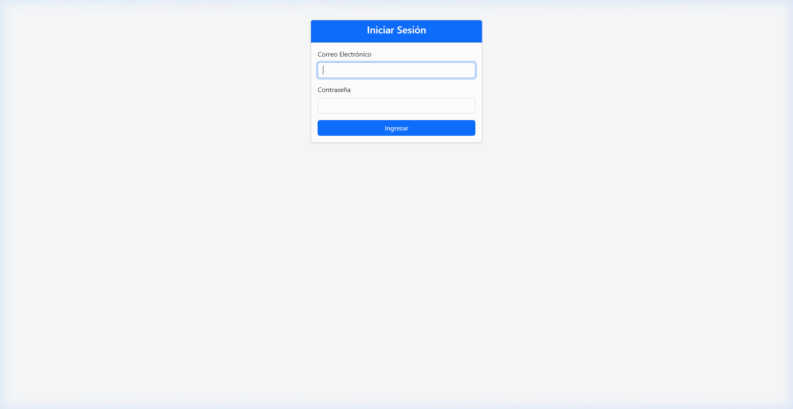
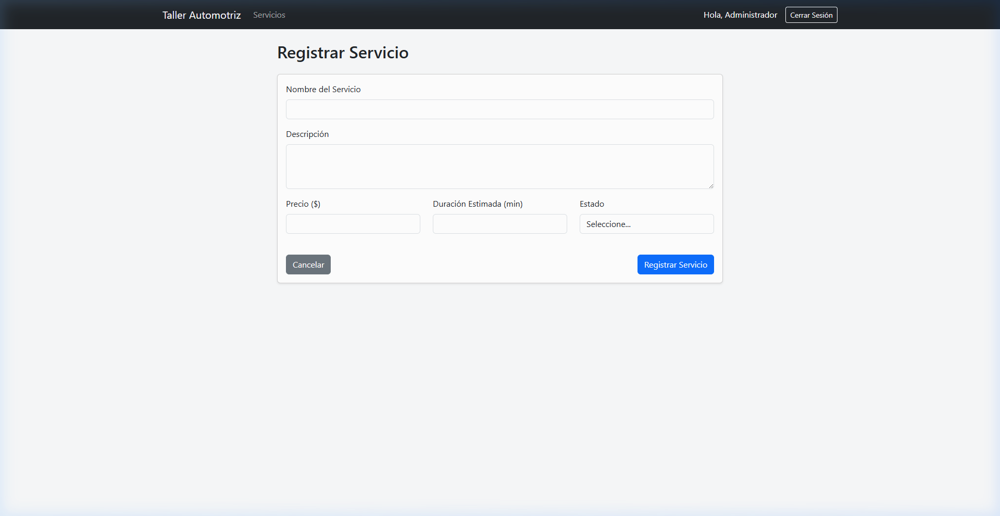
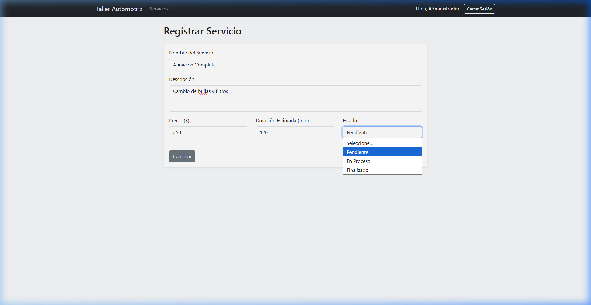
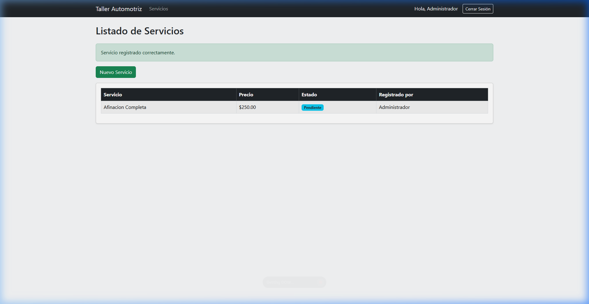
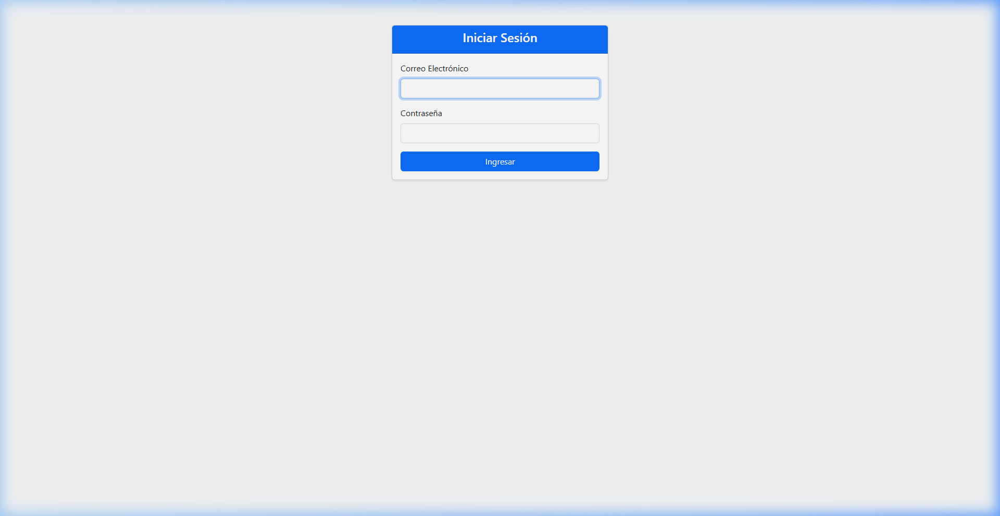

# Sistema Taller Automotriz (Segundo Examen Parcial)

Este proyecto es un sistema de gestión para un Taller Automotriz desarrollado en Laravel 11. Implementa un sistema de autenticación manual (sin Breeze ni Jetstream) y un módulo completo para el registro de servicios conectado a MySQL.

## Entorno de Desarrollo
* **Servidor:** Laragon
* **Lenguaje:** PHP 8.x
* **Base de Datos:** MySQL
* **Framework:** Laravel 11
* **Frontend:** Bootstrap 5.3 (CDN)

## Usuarios de Prueba (Seeder)
El proyecto incluye un seeder (`UserSeeder`) que genera los dos usuarios solicitados con contraseñas hasheadas (`Hash::make()`):
1. **Administrador:** `admin@taller.com` / `12345678`
2. **Mecánico:** `mecanico@taller.com` / `12345678`

---

## Pasos de Instalación

1. **Clonar el repositorio:**
   ```bash
   git clone https://github.com/xoce-03/empanada_de_choclo.git
   cd empanada_de_choclo
   ```

2. **Instalar dependencias de Composer:**
   ```bash
   composer install
   ```

3. **Configurar las variables de entorno:**
   Verificar el archivo `.env`:
   ```env
   DB_CONNECTION=mysql
   DB_HOST=127.0.0.1
   DB_PORT=3306
   DB_DATABASE=taller_automotriz
   DB_USERNAME=root
   DB_PASSWORD=
   ```

4. **Crear la Base de Datos:**
   ```sql
   CREATE DATABASE taller_automotriz;
   ```
   *(También se incluye el respaldo `base_de_datos.sql` en la raíz del proyecto).*

5. **Ejecutar Migraciones y Seeder:**
   ```bash
   php artisan migrate
   php artisan db:seed
   ```

6. **Levantar el Servidor:**
   ```bash
   php artisan serve
   ```
   Acceder desde el navegador en `http://127.0.0.1:8000`.

---

## Pruebas de Funcionamiento

### 1. Pantalla Inicial (Login)
Al acceder a `http://127.0.0.1:8000`, la ruta raíz redirige directamente al Login.



### 2. Autenticación Manual
Inicio de sesión con validaciones del lado del servidor y manejo de errores.



### 3. Formulario de Registro de Servicio
Registro de nuevo servicio sin solicitar el `user_id` en la interfaz.



### 4. Módulo de Servicios y Usuario Propietario
El listado muestra todos los servicios almacenados en MySQL indicando qué usuario los registró mediante relaciones Eloquent (`$servicio->user->name`).



### 5. Cierre de Sesión (Logout)
Destrucción de la sesión, regeneración del token CSRF y redirección automática al Login.


